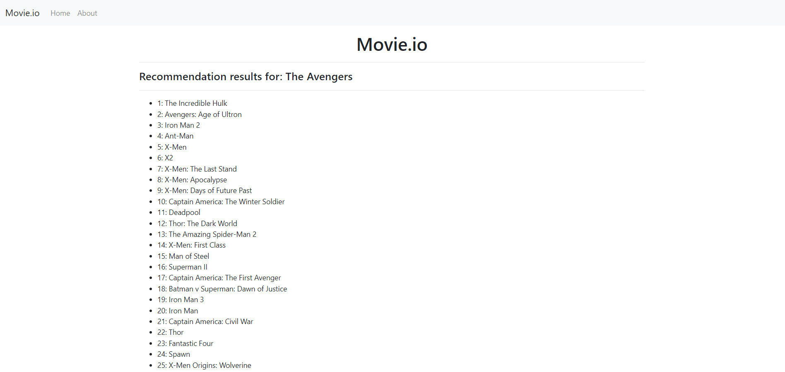

*Created by Aniq Premji*

This app implements a [content-based movie recommendation engine](https://www.analyticssteps.com/blogs/what-content-based-recommendation-system-machine-learning) using a cosine similarity algorithm and the NumPy, pandas and scikit-learn libraries.

A list of 5000 movies from IMDB are used in this project. Using a combination of the words in the 'keywords' and 'genre' columns from the dataset, each movie is represented as a vector, with each word representing a dimension. The cosine of the angle between the vectors is calculated to determine how similar the movies are.




# Getting Started

## Installing pip
First, make sure you have ```pip``` installed on your system. Run the following command to display the current version of ```pip``` installed on your system:

* Windows: ```py -m pip --version```

* Unix/MacOS: ```python3 -m pip install --user virtualenv```

## Installing and creating a virtual environment
Install virtual environments with the following:

* Windows: ```py -m pip install --user virtualenv```

* Unix/MacOS ```python3 -m pip install --user virtual env```

Next, create a virtual environment by executing the following code in the project's root directory:

* Windows: ```py -m venv env```

* Unix/MacOS: ```python3 -m venv env```

To activate the environment, run ```env\Scripts\activate``` on Windows and ```source env/bin/activate``` for Unix/MacOS.

To install the packages required for the project, run ```py -m pip install -r requirements.txt``` on Windows and ```python3 -m pip install -r requirements.txt``` on Unix/MacOS.

## Usage Guide
In the terminal, run the ```flask run``` command. Click the link provided by the ```Running on:``` statement in the terminal. Once the app is open, enter a movie into the form. If it exists in the database, you will be recommended 50 movies similar to it!

